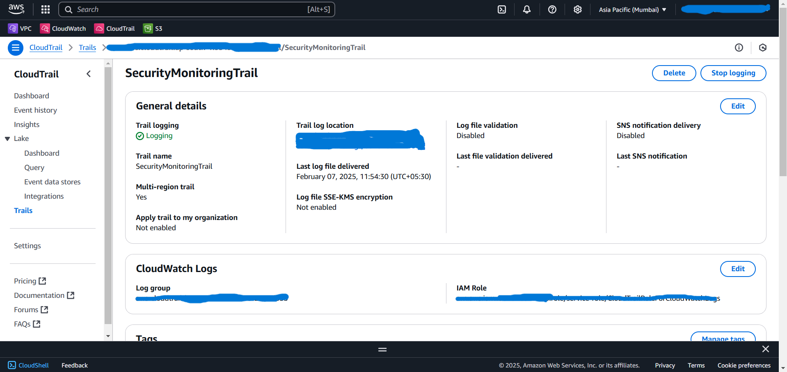

#  Arduino to AWS IoT- Amazon S3, Cloud Integration

This project connects an Arduino with AWS cloud services. It collects sensor data using Arduino and sends it to AWS IoT Core. From there, the data is processed using AWS Lambda and stored in S3. Logs can be viewed and monitored  in Cloud Watch. Cloud Watch Alarm is set for unusual behaviour.

##  Architecture
   

##  AWS Services Used

- AWS IAM (Identity and Access Management) - Used to create, manage and control access for users, groups and roles.
- AWS IoT Core - receives data from Arduino.
- Dynamo db - used to store raw Iot messages and real time monitoring.
- VPC Private/Public subntes - to secure Lambda funtions.
- AWS Lambda - processes the data.
- Amazon S3 - stores data for long time archival.
- Amazon CloudWatch - monitoring, logging and view metrics.
- Alarms - Used to alert specified users when the threshold is hit.
- Cloud Trail - auditing actions.
- SNS - Notifications and alerts.

## Project Flow

1. Sensors and Arduino UNO : Collects data i.e temperature , humidity and distance. process the data.
2. Python IDE : Certificate, Private key, Public key and AWS IoT Core end point arn were being utilized to Authenticate and Encryption of data to transmit data securely.
3. MQTT : MQTT protocol used to transmit data from device i.e laptop to AWS IoT core.
4. AWS IoT Core : AWS service which connects AWS cloud to other devices, in our project it recives data from arduino/device.
5. Dynamo db : Collects the data from arduino stores data in semi-structured JSON format, used for real time monitoring.
6. AWS Lambda : Processing the payload and send the data securely to specified Amazon S3.
7. Amazon S3 : Bucket policy is utilized to Authorize and control access to data , stores the data for long time archival.
8. Cloud Watch : provides the logs and metrics to monitor the services and data.
9. Cloud trail : Used to audit every action in aws account.
10. Alarm : Used to trigger the specified SNS topic when a defined threshold is breached.
11. Simple Notification Service (SNS) : Subscribed user gets the message.

##  Sample Outputs

###  Dynamo db data entry

### Lambda Function

### S3 data entry

distance data

temperature data

### Alarm

### Cloud trail

## Monitoring and Alerting 
- CloudWatch logs, CloudTrail logs, alarms and SNS services help to monitor activity and notify unusual events.

#  Skills Demonstrated

- IoT + Cloud Integration
- Serverless architecture
- Real-time data processing
- AWS monitoring (CloudWatch)
- Cloud Watch alarms and SNS Notifications
- Secure AWS access with IAM